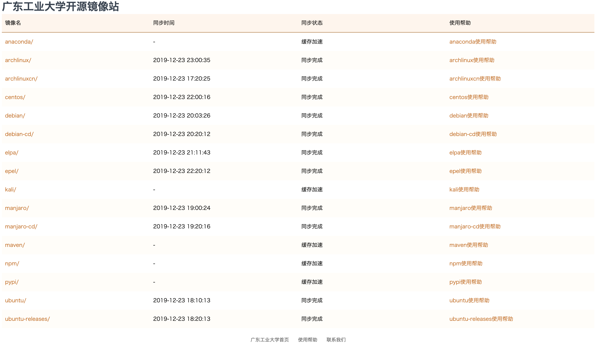

# GDUT开源镜像站

http://mirrors.gdut.edu.cn/ 仅校园网可访问

# 架构

Nginx提供web服务。

由于服务器硬盘空间有限，所以把源分为全量镜像源和缓存源。

全量镜像使用Rsync同步。

缓存使用Nginx自带的proxy_cache模块。

# 文件目录说明

under construction

# 脚本说明

under construction

# 运维文档

## 新增一个源的步骤

### 全量镜像源

1. 调研目标源的镜像方法（一般去官网的wiki上找），如果国外源速度太慢，可以考虑从清华镜像或中科大镜像Rysnc
2. 修改镜像脚本`mirror.sh`，新增一行同步命令
3. 新增一个以镜像源命名的html文件，即帮助页面
4. 服务器上执行脚本进行首次同步
5. 修改`crontab`，设置同步时间
6. 模拟用户使用，检查是否正常

### 缓存源

under construction

# New Mirror List

|镜像|预估大小|文档|备注|
|---|---|---|---|
|gentoo|426G|待google||
|freebsd|600G|https://www.freebsd.org/doc/en_US.ISO8859-1/articles/hubs/mirror-howto.html ||
|freebsd-ports|534G|https://www.freebsd.org/doc/en_US.ISO8859-1/articles/hubs/mirror-howto.html ||
|lxc-images|待google|待google|如果上LXD集群，就考虑使用|
|docker|缓存加速|参考 http://mirrors.ustc.edu.cn/help/dockerhub.html |需要子域名，以后发展好再考虑|
|ros|431GB|http://wiki.ros.org/Mirrors||
|fedora|1.13T|待google||
