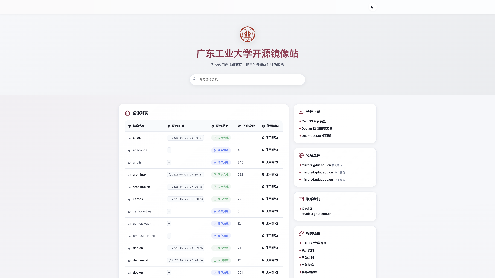
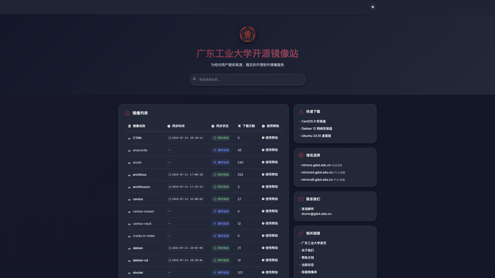
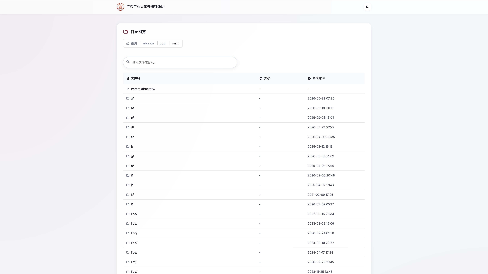
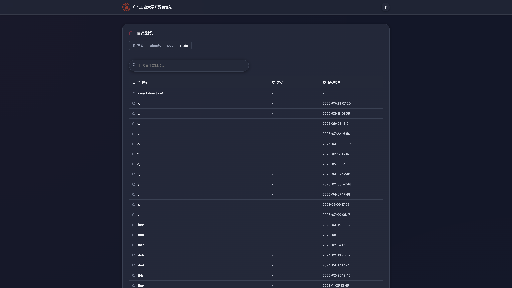
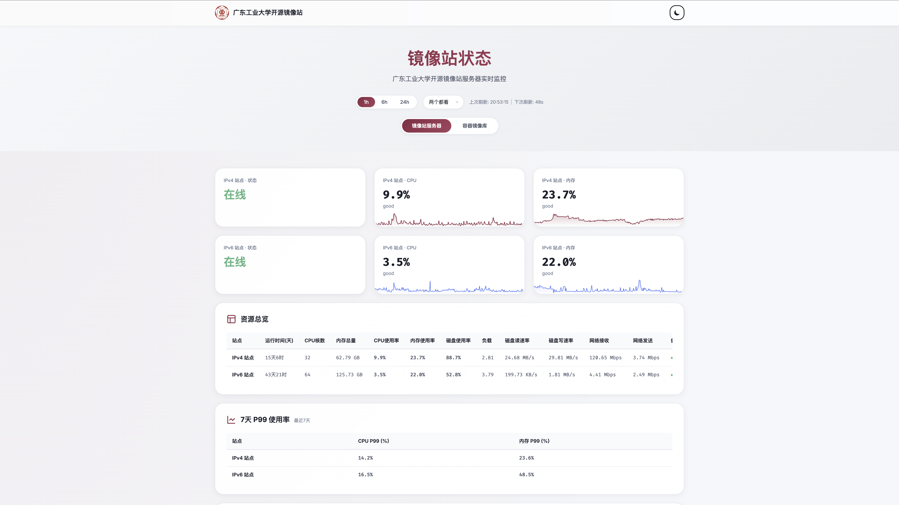
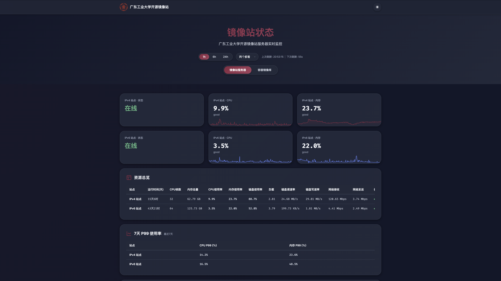
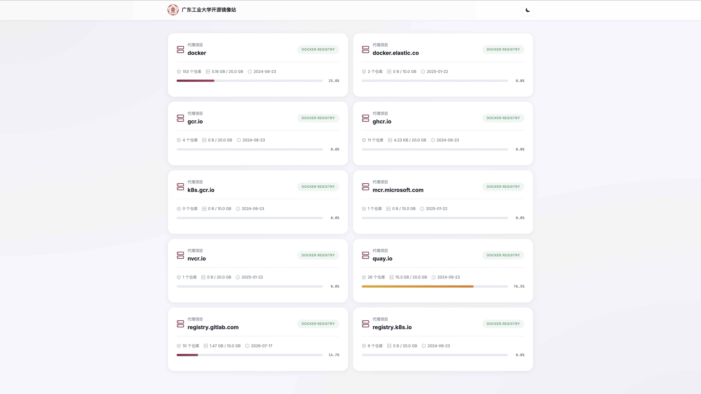
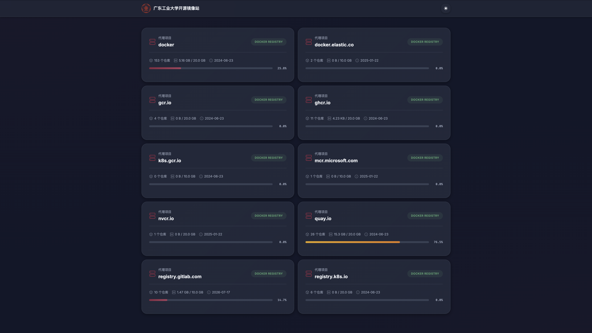
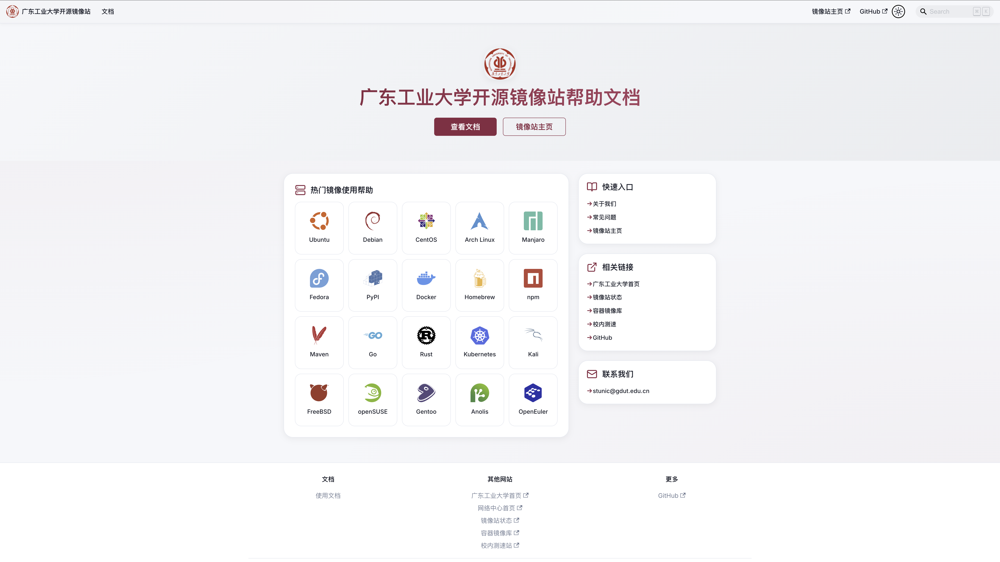
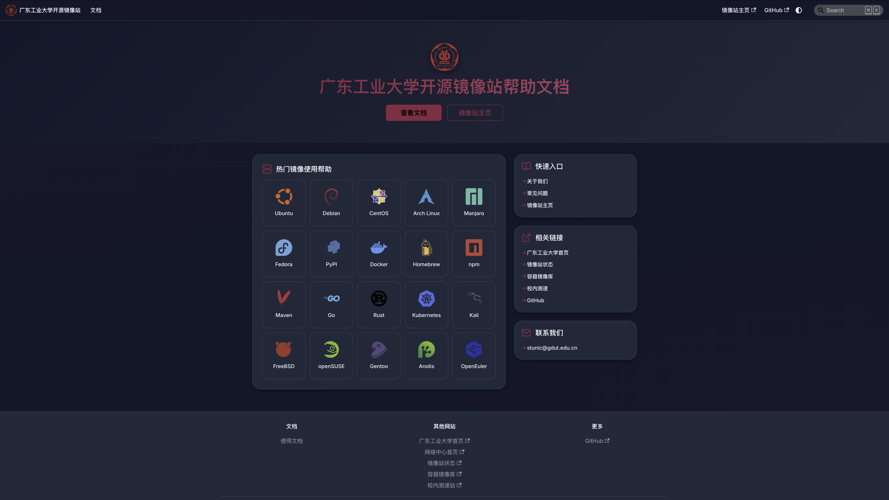

# 广东工业大学开源镜像站

> 网址：[https://mirrors.gdut.edu.cn](https://mirrors.gdut.edu.cn)（仅校园网可访问）
>
> 制品仓库：[https://repo.gdut.edu.cn](https://repo.gdut.edu.cn)（Maven / npm / nuget / composer / Go / crates.io 等包代理）
>
> 容器镜像库：[https://registry.gdut.edu.cn](https://registry.gdut.edu.cn)
>
> 由广东工业大学学生网管队建立与维护，致力于为校内用户提供高速、稳定的开源软件镜像服务。

交流群：`VVZIbnZxVHZ2Sm80T1RNM09USTVORFVLCg==`

## 截图预览

| 页面 | ☀️ 浅色主题 | 🌙 深色主题 | 说明 |
|------|------------|------------|------|
| 主页 |  |  | Bento Grid 布局，左侧镜像列表（名称 / 同步时间 / 同步状态 / 下载次数 / 使用帮助），右侧侧边栏提供快速下载、域名选择、联系方式和相关链接 |
| 目录浏览 |  |  | 基于 Nginx Fancy Index，支持面包屑导航、文件搜索、虚拟滚动（大目录性能优化），文件夹 / 文件 / 返回上级均使用 SVG 图标 |
| 状态监控 |  |  | 原生页面直查 Prometheus，ECharts 绘制时序图表。涵盖镜像站服务器和容器镜像库两个 Tab，展示 CPU / 内存 / 磁盘 / 负载 / 网络流量 / 镜像统计等指标 |
| Docker 镜像使用帮助 |  |  | Docker 镜像源配置文档，包含前缀添加模式和域名置换模式的命令示例及代理地址对照表 |
| 使用帮助文档 |  |  | 各镜像源均提供详细的使用帮助页面，包含配置命令示例和代理地址对照表 |

---

## 架构概览

```
                         ┌──────────────────────────────────────────┐
                         │           Nginx (mirrors.gdut.edu.cn)     │
                         │  ┌────────────┐  ┌─────────────────────┐ │
  校内用户 ──HTTP/HTTPS──▶│  │ 全量镜像    │  │ 缓存镜像 (proxy_cache)│ │
                         │  │ /mnt/mirror │  │ /home/mirror/       │ │
                         │  │            │  │   nginx_cache/      │ │
                         │  └─────┬──────┘  └──────────┬──────────┘ │
                         └────────┼────────────────────┼────────────┘
                                  │                    │
                         ┌────────▼────────┐  ┌────────▼────────┐
                         │  Rsync 同步脚本  │  │  上游镜像站回源   │
                         │  (mirror.sh +    │  │  (清华/中科大/   │
                         │   crontab 定时)  │  │   北外/阿里云等) │
                         └─────────────────┘  └─────────────────┘

  ┌──────────────────────────────┐    ┌──────────────────────────────┐
  │ Nginx (repo.gdut.edu.cn)      │    │ Nginx (registry.gdut.edu.cn) │
  │  反代 → K8s Nexus              │    │  反代 → K8s Harbor            │
  │  Maven/npm/nuget/composer/    │    │  Docker Hub/ghcr.io/quay.io  │
  │  Go/crates.io 包代理           │    │  等容器镜像代理               │
  └──────────────────────────────┘    └──────────────────────────────┘
```

- **全量镜像**：通过 Rsync 从上游镜像站同步到本地磁盘 `/mnt/mirror/`，由 `mirror.sh` 脚本和 crontab 定时执行。
- **缓存镜像**：利用 Nginx `proxy_cache` 模块按需回源缓存，适用于体积大但实际使用频率低的镜像（如 pypi、anaconda 等），节省磁盘空间。
- **制品仓库**：基于 Nexus 搭建，代理 Maven / npm / nuget / composer / Go / crates.io 等包仓库，部署在 Kubernetes 集群上，通过独立域名 `repo.gdut.edu.cn` 提供服务。
- **容器镜像库**：基于 Harbor 搭建，代理 Docker Hub / ghcr.io / quay.io 等容器镜像源，部署在 Kubernetes 集群上，通过独立域名 `registry.gdut.edu.cn` 提供服务。
- **状态监控**：原生 HTML + ECharts 页面，直接查询 Prometheus 数据源，实时展示服务器和容器镜像库的运行状态。

## 镜像列表

### 全量镜像（Rsync 同步）

| 镜像 | 上游 | 同步频率 |
|------|------|---------|
| Ubuntu | 北京外国语镜像 | 每 6 小时 |
| Ubuntu Releases | 北京外国语镜像 | 每 6 小时 |
| ELPA | elpa.emacs-china.org | 每 6 小时 |
| Debian | 清华镜像 (ftpsync) | 每 6 小时 |
| Debian CD | 北京外国语镜像 | 每 6 小时 |
| Gentoo | masterdistfiles.gentoo.org | 每 6 小时 |
| CentOS | 北京外国语镜像 | 每 6 小时 |
| EPEL | 清华镜像 | 每 6 小时 |
| Arch Linux | 中科大镜像 | 每 6 小时 |
| Arch Linux CN | 中科大镜像 | 每 6 小时 |
| Anolis | Anolis 官方 | 手动 |
| CentOS Stream | 北京外国语镜像 | 手动 |
| CTAN | 北京外国语镜像 | 手动 |
| Docker CE | 清华镜像 | 手动 |
| FreeBSD | ftp2.jp.FreeBSD.org | 手动 |
| Homebrew Bottles | 清华镜像 | 手动 |
| Kali Images | 清华镜像 | 手动 |
| Kubernetes | 清华镜像 | 手动 |
| Manjaro | 中科大镜像 | 手动 |
| Manjaro CD | 中科大镜像 | 手动 |
| openEuler | OpenEuler 官方 | 手动 |
| Raspberry Pi | apt-repo.raspberrypi.org | 手动 |
| Raspbian | archive.raspbian.org | 手动 |
| Termux | 清华镜像 | 手动 |

### 缓存镜像（Nginx proxy_cache）

anaconda、anolis、centos-stream、centos-vault、crates.io-index、docker、fedora、freebsd-pkg、go、homebrew、kali、maven、npm、opensuse、openwrt、pypi、rubygems、ubuntu-ports

### 制品仓库代理（Nexus）

| 仓库 | 类型 | 说明 |
|------|------|------|
| maven | Maven | Maven 中央仓库代理 |
| npm | npm | npm registry 代理 |
| nuget | NuGet | NuGet Gallery 代理 |
| composer | Composer | Packagist 代理 |
| go | Go Module | Go Module Proxy 代理 |
| crates.io-index | Rust | crates.io 索引代理 |

### 容器镜像库代理（Harbor）

| 名称 | 目标 URL | 提供者 | 备注 |
|------|---------|--------|------|
| docker | https://hub.docker.com | Docker Hub | DockerHub 镜像源 |
| ghcr.io | https://ghcr.io | Docker Registry | GitHub Container Registry |
| quay.io | https://quay.io | Quay | RedHat Quay.io |
| mcr.microsoft.com | https://mcr.microsoft.com | Docker Registry | Microsoft Artifact Registry |
| gcr.io | https://gcr.io | Docker Registry | Google Container Registry |
| registry.k8s.io | https://registry.k8s.io | Docker Registry | Kubernetes Container Registry |
| nvcr.io | https://nvcr.io | Docker Registry | Nvidia Container Registry |
| docker.elastic.co | https://docker.elastic.co | Docker Registry | Elastic Docker Registry |

## 项目结构

```
mirrors-gdut/
├── mirror.sh                  # Rsync 同步主脚本（全量镜像）
├── mirror_index.py            # 主页生成脚本（读取镜像列表 + 同步状态 → index.html）
├── mirror_render_help_pages.py# 使用帮助页面渲染脚本（模板 → HTML）
├── mirror_stats_json.py       # 镜像统计数据聚合脚本（du 扫描 → JSON，供状态页消费）
├── mirror_auto_cache.py       # 缓存预热脚本（下载清华日志 → 预热热门包）
├── mirror_daily_summary.py    # 每日访问统计（解析 Nginx 日志 → 微信推送）
├── mirror_disk_summary.py     # 磁盘占用统计（du 扫描 → 微信推送）
├── mirror_cache_stat.sh       # 缓存统计脚本（root 用户执行）
├── record_access_times.py     # 下载次数统计（解析 Nginx 日志 → CSV）
├── memory_cache_status.py     # 内存缓存状态检查
├── mod_weixin.py              # 企业微信推送模块
├── crontab                    # mirror 用户 crontab 配置
├── crontab_root               # root 用户 crontab 配置
├── etc/
│   └── ftpsync.conf           # Debian ftpsync 配置
├── ubuntu/
│   ├── archive.sh             # Ubuntu 镜像同步脚本
│   └── release.sh             # Ubuntu Releases 同步脚本
├── nginx_conf/
│   ├── nginx.conf             # Nginx 主配置
│   └── conf/
│       ├── registry.gdut.edu.cn.conf  # 容器镜像库 Nginx 配置
│       ├── repo.gdut.edu.cn.conf      # 制品仓库 Nginx 配置
│       └── mirror/
│           ├── mirror.conf            # 镜像站主配置（全量 + 缓存 + 反代）
│           ├── nginx_maintenance.conf # 维护页面备用镜像配置
│           ├── cache_2h.conf          # 缓存策略：2 小时过期
│           ├── cache_30d.conf         # 缓存策略：30 天过期
│           ├── proxy_pass_aliyun.conf # 回源：阿里云
│           ├── proxy_pass_tsinghua.conf # 回源：清华
│           ├── proxy_pass_ustc.conf   # 回源：中科大
│           ├── proxy_pass_nju.conf    # 回源：南大
│           └── proxy_pass_rubygems.conf # 回源：RubyGems
├── pages/                     # 静态页面资源
│   ├── about.html             # 关于页面
│   ├── status.html            # 状态监控页面
│   ├── status.js              # 状态页 JS（Prometheus 查询 + ECharts 图表）
│   ├── status.css             # 状态页样式
│   ├── mirror.css             # 共享设计系统样式（Island UI）
│   ├── mirror.js              # 共享设计系统 JS（主题切换 + FancyIndex 增强）
│   ├── favicon.ico
│   ├── GDUT_Logo.png
│   └── maven.jpg
├── help_pages_template/       # 使用帮助页面模板（36 个镜像源）
│   ├── docker.html            # Docker 镜像使用帮助
│   ├── ubuntu.html            # Ubuntu 使用帮助
│   ├── debian.html            # Debian 使用帮助
│   ├── pypi.html              # PyPI 使用帮助
│   └── ...                    # 更多镜像源帮助页面
├── Nginx-Fancyindex-Theme/
│   └── gdut-mirrors/          # Fancy Index 主题（与 pages/ 同步）
│       ├── header.html        # 目录页头部模板
│       ├── footer.html        # 目录页尾部模板
│       ├── mirror.css         # 与 pages/mirror.css 同步
│       └── mirror.js          # 与 pages/mirror.js 同步
├── scripts/
│   ├── configure-docker-registry.sh  # Docker Registry 配置脚本（Linux）
│   ├── configure-docker-registry.ps1 # Docker Registry 配置脚本（Windows）
│   └── get-docker.sh                 # Docker 安装脚本
├── harbor_k8s_deploy_chart.yaml  # Harbor Kubernetes Helm 部署配置
├── nexus_k8s_deploy_chart.yaml   # Nexus Kubernetes Helm 部署配置
├── screenshots/                  # README 截图
└── OPTIMIZATION_GUIDE.md         # Fancy Index 大目录性能优化文档
```

## 部署文档

### 环境准备

1. 创建名为 `mirror` 的用户，将存储盘挂载到 `/mnt/mirror` 并设置权限
2. 切换到 `mirror` 用户，在家目录下执行：

```shell
git clone https://github.com/chn-lee-yumi/mirrors-gdut.git
git clone https://salsa.debian.org/mirror-team/archvsync.git  # 用于 Debian 的同步
mkdir /home/mirror/tmp
mkdir /home/mirror/bin
mkdir /home/mirror/etc
mkdir /home/mirror/nginx_cache
cp archvsync/bin/* bin
cp mirrors-gdut/etc/ftpsync.conf etc
cp mirrors-gdut/pages/* /mnt/mirror/

cat /home/mirror/mirrors-gdut/crontab
crontab -e  # 将上面 cat 的内容复制粘贴进来，然后保存
```

3. 将 `crontab_root` 中的内容配置到 root 用户的 crontab 中

4. 等待镜像同步完成（首次同步需要一两天）

5. 同步完成后使用 `mirror` 用户执行命令渲染帮助页面：

```shell
python3 mirror_render_help_pages.py
```

帮助页面模板在 `help_pages_template` 目录下，修改后需重新执行渲染命令。

### 安装 Nginx

#### 编译安装

为了监控流量，项目集成了 `nginx-module-vts` 模块，需手动编译 Nginx。如不需要此模块，可注释 `nginx.conf` 中对应的配置。

以 CentOS 7 为例：

```shell
yum -y install gperftools pcre pcre-devel openssl openssl-devel gcc-c++ autoconf automake gd-devel libxml2 libxslt-devel perl-devel perl-ExtUtils-Embed GeoIP GeoIP-devel GeoIP-data
wget http://nginx.org/download/nginx-1.18.0.tar.gz
tar xzf nginx-1.18.0.tar.gz
cd nginx-1.18.0
git clone https://github.com/vozlt/nginx-module-vts.git
./configure --prefix=/usr/share/nginx --sbin-path=/usr/sbin/nginx --modules-path=/usr/lib64/nginx/modules --conf-path=/etc/nginx/nginx.conf --error-log-path=/var/log/nginx/error.log --http-log-path=/var/log/nginx/access.log --http-client-body-temp-path=/var/lib/nginx/tmp/client_body --http-proxy-temp-path=/var/lib/nginx/tmp/proxy --http-fastcgi-temp-path=/var/lib/nginx/tmp/fastcgi --http-uwsgi-temp-path=/var/lib/nginx/tmp/uwsgi --http-scgi-temp-path=/var/lib/nginx/tmp/scgi --pid-path=/run/nginx.pid --lock-path=/run/lock/subsys/nginx --user=nginx --group=nginx --with-file-aio --with-ipv6 --with-http_ssl_module --with-http_v2_module --with-http_realip_module --with-stream_ssl_preread_module --with-http_addition_module --with-http_xslt_module=dynamic --with-http_image_filter_module=dynamic --with-http_geoip_module=dynamic --with-http_sub_module --with-http_dav_module --with-http_flv_module --with-http_mp4_module --with-http_gunzip_module --with-http_gzip_static_module --with-http_auth_request_module --with-http_random_index_module --with-http_secure_link_module --with-http_degradation_module --with-http_slice_module --with-http_stub_status_module --with-http_perl_module=dynamic --with-mail=dynamic --with-mail_ssl_module --with-stream=dynamic --with-stream_ssl_module --with-stream_realip_module --with-stream_geoip_module=dynamic --with-stream_ssl_preread_module --with-google_perftools_module --add-module=nginx-module-vts --with-cc-opt='-O2 -g -pipe -Wall -Wp,-D_FORTIFY_SOURCE=2 -fexceptions -fstack-protector-strong --param=ssp-buffer-size=4 -grecord-gcc-switches -m64 -mtune=generic' --with-ld-opt='-Wl,-z,relro -Wl,-E' --with-pcre --with-pcre-jit --with-debug
make
make install
```

拷贝并加载配置：

```shell
cp /home/mirror/mirrors-gdut/nginx_conf/* /usr/local/nginx/conf/
nginx -t
nginx -s reload
```

#### Docker 部署

暂未找到支持 `nginx-module-vts` 模块的官方镜像，如不需要流量监控可使用官方 Nginx 镜像：

```shell
docker pull nginx:latest
docker run --name nginx -p 80:80 --restart always \
  -v /home/mirror/mirrors-gdut/nginx_conf/nginx.conf:/etc/nginx/nginx.conf:ro \
  -v /home/mirror/mirrors-gdut/nginx_conf/cache_2h.conf:/etc/nginx/cache_2h.conf:ro \
  -v /home/mirror/mirrors-gdut/nginx_conf/cache_30d.conf:/etc/nginx/cache_30d.conf:ro \
  -v /home/mirror/mirrors-gdut/nginx_conf/proxy_pass_aliyun.conf:/etc/nginx/proxy_pass_aliyun.conf:ro \
  -v /home/mirror/mirrors-gdut/nginx_conf/proxy_pass_tsinghua.conf:/etc/nginx/proxy_pass_tsinghua.conf:ro \
  -v /home/mirror/mirrors-gdut/nginx_conf/proxy_pass_ustc.conf:/etc/nginx/proxy_pass_ustc.conf:ro \
  -v /mnt/mirror:/mnt/mirror:ro -d nginx:latest
```

### 部署 Nexus

> Nexus 使用独立域名 `repo.gdut.edu.cn`，代理 Maven / npm / nuget / composer / Go / crates.io 等包仓库。Nginx 配置见 `nginx_conf/conf/repo.gdut.edu.cn.conf`，通过反向代理将请求转发至 Kubernetes 集群中的 Nexus 服务。

**Docker：**

```bash
docker pull sonatype/nexus3
docker run -d -p 8081:8081 --restart always -v /home/mirror/nexus:/nexus-data --name nexus sonatype/nexus3
```

**Kubernetes (Helm)：**

```bash
helm repo add sonatype https://sonatype.github.io/helm3-charts/
helm repo update
```

编辑 `values.yaml`：

```yaml
ingress:
  enabled: true
  ingressClassName: nginx
  annotations:
    nginx.ingress.kubernetes.io/proxy-body-size: "0"
  hostPath: /
  hostRepo: repo.gdut.edu.cn
  tls:
    - secretName: nexus-tls
      hosts:
        - repo.gdut.edu.cn

persistence:
  enabled: true
  accessMode: ReadWriteOnce
  storageClass: "storageclass"
  storageSize: 100Gi
```

安装：

```bash
helm -n gdut-mirrors upgrade --install sonartype/nexus --values values.yaml
```

### 部署 Harbor

> Harbor 使用独立域名 `registry.gdut.edu.cn`，专门用于容器镜像缓存。

#### Docker 部署

**1. 下载安装包并配置**

```bash
wget -c https://github.com/goharbor/harbor/releases/download/v2.8.0/harbor-offline-installer-v2.8.0.tgz
tar xvf harbor-offline-installer-v2.8.0.tgz -C /harbor && cd /harbor
cp harbor.yml.tmpl harbor.yml && gedit harbor.yml
```

配置 `harbor.yml`：

```yaml
hostname: registry.gdut.edu.cn

http:
  port: 80

https:
  port: 443
  certificate: /path/to/cert
  private_key: /path/to/key

harbor_admin_password: Harbor12345

database:
  password: Harbor12345

data_volume: /home/harbor
```

**2. 生成证书**（如使用 HTTP 访问可跳过，需注释 `harbor.yml` 中 HTTPS 相关配置；也可直接使用公共证书）

```bash
mkdir cert && cd cert

# CA 证书
openssl genrsa -out ca.key 4096
openssl req -x509 -new -nodes -sha512 -days 3650 \
  -subj "/C=CN/ST=Beijing/L=Beijing/O=example/OU=Personal/CN=registry.gdut.edu.cn" \
  -key ca.key -out ca.crt

# 服务器证书
openssl genrsa -out registry.gdut.edu.cn.key 4096
openssl req -sha512 -new \
  -subj "/C=CN/ST=Beijing/L=Beijing/O=example/OU=Personal/CN=registry.gdut.edu.cn" \
  -key registry.gdut.edu.cn.key \
  -out registry.gdut.edu.cn.csr

# x509 v3 扩展
cat > v3.ext <<-EOF
authorityKeyIdentifier=keyid,issuer
basicConstraints=CA:FALSE
keyUsage = digitalSignature, nonRepudiation, keyEncipherment, dataEncipherment
extendedKeyUsage = serverAuth
subjectAltName = @alt_names
[alt_names]
DNS.1=registry.gdut
DNS.2=registry.gdut.edu.cn
EOF

# 签发证书
openssl x509 -req -sha512 -days 3650 \
  -extfile v3.ext \
  -CA ca.crt -CAkey ca.key -CAcreateserial \
  -in registry.gdut.edu.cn.csr \
  -out registry.gdut.edu.cn.crt
```

**3. 安装**

```bash
./install.sh
```

如使用自签证书，需将证书配置到 Docker：

```bash
openssl x509 -inform PEM -in registry.gdut.edu.cn.crt -out registry.gdut.edu.cn.cert

mkdir -p /etc/docker/certs.d/registry.gdut.edu.cn
cp registry.gdut.edu.cn.cert /etc/docker/certs.d/registry.gdut.edu.cn/
cp registry.gdut.edu.cn.key /etc/docker/certs.d/registry.gdut.edu.cn/
cp ca.crt /etc/docker/certs.d/registry.gdut.edu.cn/
```

在 `/etc/docker/daemon.json` 中添加：

```json
"insecure-registries": ["registry.gdut.edu.cn"]
```

重启 Docker：`systemctl restart docker`

**4. 开机自启（可选）**

创建 `/etc/systemd/system/harbor.service`：

```ini
[Unit]
Description=Harbor
After=docker.service systemd-networkd.service systemd-resolved.service
Requires=docker.service
Documentation=https://github.com/goharbor/harbor

[Service]
Type=simple
Restart=on-failure
RestartSec=5
ExecStart=/usr/local/bin/docker-compose -f /harbor/docker-compose.yml up
ExecStop=/usr/local/bin/docker-compose -f /harbor/docker-compose.yml down

[Install]
WantedBy=multi-user.target
```

```bash
chmod +x harbor.service
systemctl enable harbor.service
systemctl start harbor.service
```

#### Kubernetes 部署

```bash
helm repo add harbor https://helm.goharbor.io
helm repo update
```

编辑 `values.yaml`：

```yaml
expose:
  type: ingress
  tls:
    enabled: true
    certSource: auto
    auto:
      commonName: "example@example.com"
  ingress:
    hosts:
      core: registry.gdut.edu.cn
    className: "nginx"
    annotations:
      ingress.kubernetes.io/ssl-redirect: "false"
      ingress.kubernetes.io/proxy-body-size: "0"
      nginx.ingress.kubernetes.io/ssl-redirect: "false"
      nginx.ingress.kubernetes.io/proxy-body-size: "0"
      kubernetes.io/ingress.class: nginx
      kubernetes.io/ingress.provider: nginx

externalURL: https://registry.gdut.edu.cn

persistence:
  enabled: true
  persistentVolumeClaim:
    registry:
      existingClaim: ""
      storageClass: "storageclass"
      subPath: ""
      accessMode: ReadWriteOnce
      size: 5Gi
      annotations: {}
    jobservice:
      jobLog:
        existingClaim: ""
        storageClass: "nfs-client-02"
        subPath: ""
        accessMode: ReadWriteOnce
        size: 1Gi
        annotations: {}
    database:
      existingClaim: ""
      storageClass: "nfs-client-02"
      subPath: ""
      accessMode: ReadWriteOnce
      size: 1Gi
      annotations: {}
    redis:
      existingClaim: ""
      storageClass: "nfs-client-02"
      subPath: ""
      accessMode: ReadWriteOnce
      size: 1Gi
      annotations: {}
    trivy:
      existingClaim: ""
      storageClass: "nfs-client-02"
      subPath: ""
      accessMode: ReadWriteOnce
      size: 5Gi
      annotations: {}

existingSecretAdminPasswordKey: HARBOR_ADMIN_PASSWORD
harborAdminPassword: "Your Admin Password"

trivy:
  enabled: true

metrics:
  enabled: true
  serviceMonitor:
    enabled: true
```

安装：

```bash
helm -n gdut-mirrors upgrade --install harbor/harbor --values values.yaml
```

## 运维文档

### 新增全量镜像源

1. 调研目标源的镜像方法（一般在官网 Wiki 上找），国外源速度太慢可从清华或中科大镜像 Rsync
2. 修改 `mirror.sh`，新增一行同步命令
3. 在 `help_pages_template/` 下新增以镜像源命名的 HTML 帮助页面
4. 在服务器上执行脚本进行首次同步：`./mirror.sh <镜像名>`
5. 修改 `crontab`，设置同步时间
6. 修改 `nginx_maintenance.conf`，设置合适的备用镜像
7. 模拟用户使用，检查是否正常

### 新增缓存镜像源

参考 `nginx_conf/conf/mirror/mirror.conf`，配置 `proxy_cache_path` 和 `location` 即可。

示例：

```nginx
# centos-vault 缓存
proxy_cache_path /home/mirror/nginx_cache/centos-vault levels=2:2 keys_zone=cache_centos_vault:1m max_size=5G inactive=30d use_temp_path=off;

server {
    # ...

    # 反代到清华，所有文件缓存 30 天
    location /centos-vault/ {
        include /home/nginx/conf/mirror/proxy_pass_tsinghua.conf;
        proxy_cache cache_centos_vault;
        include /home/nginx/conf/mirror/cache_30d.conf;
    }
}
```

### 定时任务

#### mirror 用户

| 频率 | 任务 |
|------|------|
| 每 6 小时 | 同步 Ubuntu / Ubuntu Releases / ELPA / Debian / Debian CD / Gentoo / CentOS / EPEL / Arch Linux / Arch Linux CN |
| 每天 23:59 | 生成当日访问统计 (`mirror_daily_summary.py`) |
| 每周日 23:30 | 生成磁盘占用统计 (`mirror_disk_summary.py`) |
| 每 2 小时 | 生成镜像统计数据 JSON (`mirror_stats_json.py`，供状态页消费) |

#### root 用户

| 频率 | 任务 |
|------|------|
| 重启后 | 限制网卡速度 + 同步时间 |
| 每小时 | NTP 时间同步 |
| 每天 0 点 | logrotate 日志轮转 |
| 每天 9:30 | 生成缓存统计数据 (`mirror_cache_stat.sh`) |

### 状态监控

状态页 (`/status.html`) 是原生 HTML + JavaScript 页面，直接查询 Prometheus 数据源，使用 ECharts 绘制图表。监控内容分为两个 Tab：

- **镜像站服务器**：IPv4 / IPv6 两个站点的 CPU / 内存 / 磁盘 / 负载 / 网络流量时序图、健康分、P99 延迟、分区可用空间、镜像统计表
- **容器镜像库**：Harbor 的存储 / 仓库数 / 镜像数 / 下载量等指标

Prometheus 数据源：

- 镜像站：`https://prometheus.gdutnic.com/api/v1`
- Kubernetes (Harbor)：`https://prometheus-k8s.gdutnic.com/api/v1`

## 技术栈

| 组件 | 技术 |
|------|------|
| Web 服务 | Nginx（含 nginx-module-vts 流量监控） |
| 目录浏览 | Nginx Fancy Index + 自定义 Island UI 主题 |
| 全量镜像同步 | Rsync + ftpsync (Debian) |
| 缓存镜像 | Nginx proxy_cache |
| 制品仓库 | Nexus (Kubernetes / Docker) |
| 容器镜像库 | Harbor (Kubernetes / Docker) |
| 前端 | 原生 HTML + CSS + JavaScript（Island UI 设计系统） |
| 图表 | ECharts 5 |
| 状态监控 | Prometheus + ECharts |
| 通知推送 | 企业微信 API |
| 定时任务 | crontab |

## 开源协议

本项目基于 [GPL-3.0](LICENSE) 协议开源。

镜像站初版于 2019 年 7 月 28 日上线，代码于 2019 年 12 月 23 日开源。
