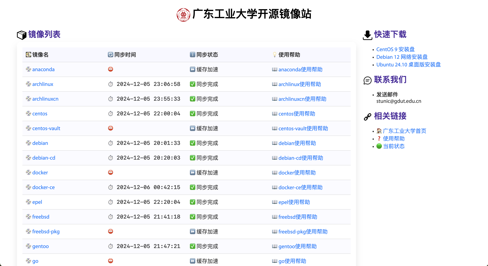

# GDUT开源镜像站

http://mirrors.gdut.edu.cn/ 仅校园网可访问



[//]: # (镜像站初版于2019年7月28日上线，代码于2019年12月23日开源。)

交流群：`VVZIbnZxVHZ2Sm80T1RNM09USTVORFVLCg==`

# 架构

Nginx提供web服务。

由于服务器硬盘空间有限，所以把源分为全量镜像源和缓存源。

全量镜像使用Rsync同步。

缓存使用Nginx自带的proxy_cache模块。

# 部署文档

## 环境配置

创建名为`mirror`的用户，将存储盘挂载到`/mnt/mirror`并设置权限。切换到`mirror`用户，在家目录下执行：

```shell
git clone https://github.com/chn-lee-yumi/mirrors-gdut.git
git clone https://salsa.debian.org/mirror-team/archvsync.git  # 用于debian的同步
mkdir /home/mirror/tmp
mkdir /home/mirror/bin
mkdir /home/mirror/etc
mkdir /home/mirror/nginx_cache
mkdir /home/mirror/nexus
cp archvsync/bin/* bin
cp mirrors-gdut/etc/ftpsync.conf etc
cp mirrors-gdut/pages/* /mnt/mirror/

cat /home/mirror/mirrors-gdut/crontab
crontab -e  # 将上面cat的内容复制粘贴进来，然后保存
```

然后坐等一两天等镜像同步完成。

同步完成后使用`mirror`用户执行下面的命令渲染帮助页面：

```shell
python mirror_render_help_pages.py
```

帮助页面模板可以在`help_pages_template`目录下修改或新增。修改后需要重新执行渲染命令。

## 安装Nginx

### 编译安装

为了监控流量，我们加入了nginx-module-vts模块，因此需要手动编译Nginx。如果不需要此模块，可以注释`nginx.conf`中的对应配置（配置文件中写明需要nginx-module-vts的部分）。

以 CentOS 7 为例：

```shell
yum -y install gperftools pcre pcre-devel openssl openssl-devel gcc-c++ autoconf automake gd-devel libxml2 libxslt-devel perl-devel perl-ExtUtils-Embed GeoIP GeoIP-devel GeoIP-data
wget http://nginx.org/download/nginx-1.18.0.tar.gz
tar xzf nginx-1.18.0.tar.gz
cd nginx-1.18.0.tar.gz
git clone https://github.com/vozlt/nginx-module-vts.git
./configure --prefix=/usr/share/nginx --sbin-path=/usr/sbin/nginx --modules-path=/usr/lib64/nginx/modules --conf-path=/etc/nginx/nginx.conf --error-log-path=/var/log/nginx/error.log --http-log-path=/var/log/nginx/access.log --http-client-body-temp-path=/var/lib/nginx/tmp/client_body --http-proxy-temp-path=/var/lib/nginx/tmp/proxy --http-fastcgi-temp-path=/var/lib/nginx/tmp/fastcgi --http-uwsgi-temp-path=/var/lib/nginx/tmp/uwsgi --http-scgi-temp-path=/var/lib/nginx/tmp/scgi --pid-path=/run/nginx.pid --lock-path=/run/lock/subsys/nginx --user=nginx --group=nginx --with-file-aio --with-ipv6 --with-http_ssl_module --with-http_v2_module --with-http_realip_module --with-stream_ssl_preread_module --with-http_addition_module --with-http_xslt_module=dynamic --with-http_image_filter_module=dynamic --with-http_geoip_module=dynamic --with-http_sub_module --with-http_dav_module --with-http_flv_module --with-http_mp4_module --with-http_gunzip_module --with-http_gzip_static_module --with-http_auth_request_module --with-http_random_index_module --with-http_secure_link_module --with-http_degradation_module --with-http_slice_module --with-http_stub_status_module --with-http_perl_module=dynamic --with-mail=dynamic --with-mail_ssl_module --with-stream=dynamic --with-stream_ssl_module --with-stream_realip_module --with-stream_geoip_module=dynamic --with-stream_ssl_preread_module --with-google_perftools_module --add-module=nginx-module-vts --with-cc-opt='-O2 -g -pipe -Wall -Wp,-D_FORTIFY_SOURCE=2 -fexceptions -fstack-protector-strong --param=ssp-buffer-size=4 -grecord-gcc-switches -m64 -mtune=generic' --with-ld-opt='-Wl,-z,relro -Wl,-E' --with-pcre --with-pcre-jit --with-debug
make
make install
```

拷贝并加载配置：

```shell
cp /home/mirror/mirrors-gdut/nginx_conf/* /usr/local/nginx/conf/
nginx -t
nginx -s reload
```

现在应该可以访问了。

### Docker镜像

暂时没找到支持nginx-module-vts模块的镜像。

```shell
docker pull nginx:latest
docker run --name nginx -p 80:80 --restart always \
  -v /home/mirror/mirrors-gdut/nginx_conf/nginx.conf:/etc/nginx/nginx.conf:ro \
  -v /home/mirror/mirrors-gdut/nginx_conf/cache_2h.conf:/etc/nginx/cache_2h.conf:ro \
  -v /home/mirror/mirrors-gdut/nginx_conf/cache_30d.conf:/etc/nginx/cache_30d.conf:ro \
  -v /home/mirror/mirrors-gdut/nginx_conf/proxy_pass_aliyun.conf:/etc/nginx/proxy_pass_aliyun.conf:ro \
  -v /home/mirror/mirrors-gdut/nginx_conf/proxy_pass_tsinghua.conf:/etc/nginx/proxy_pass_tsinghua.conf:ro \
  -v /home/mirror/mirrors-gdut/nginx_conf/proxy_pass_ustc.conf:/etc/nginx/proxy_pass_ustc.conf:ro \
  -v /mnt/mirror:/mnt/mirror:ro -d nginx:latest
```

## Nexus安装

**使用docker：**

```bash
docker pull sonatype/nexus3
docker run -d -p 8081:8081 --restart always -v /home/mirror/nexus:/nexus-data --name nexus sonatype/nexus3
```

**使用Kubernetes：**

可以参考如下文件：

[nexus_k8s_deploy_chart.yaml](nexus_k8s_deploy_chart.yaml)

## Harbor安装

> 由于 Harbor 需要使用一个独立的域名，因此我们申请了一个新的域名 `registry.gdut.edu.cn` 专门用于 Harbor 镜像缓存

**使用docker：**

### 0. 预先准备

Docker，DockerCompose，wget，curl 需要先自行安装

### 1. 下载安装包并配置

下载harbor 安装包

```bash
wget -c https://github.com/goharbor/harbor/releases/download/v2.8.0/harbor-offline-installer-v2.8.0.tgz
tar xvf harbor-offline-installer-v2.7.0.tgz  -C /harbor && cd /harbor
cp harbor.yml.tmpl harbor.yml && gedit harbor.yml
```

配置 `harbor.yml` 文件

```yaml
...
#配置harbor服务节点的域名(注意域名要符合规范，否则在docker中会无法解析为地址)
hostname: registry.gdut.edu.cn
#配置http访问的端口，可以自定义配置。
http
  port: 80 　　
https
  port: 443　
  #https访问时的证书路径
  certificate: ...
  #访问时证书私钥路径
  private_key: ...
...
#通过http访问web页面的密码，用户名默认 admin。
harbor_admin_password: Harbor12345 　　
#harbor 数据库的密码。
database
  password: Harbor12345
...
#harbor 数据存放的路径。
data_volume: /home/harbor
...　
```

### 2. 生成证书（如果是通过http访问，则不需要生成证书，但是配置文件harbor.yml中需要把https的相关配置注释掉，当然你也可以直接使用公共证书）

生成 CA 证书秘钥：`ca.key`

```bash
mkdir cert && cd cert
openssl genrsa -out ca.key 4096
```

生成 CA 证书：`ca.crt`

```bash
openssl req -x509 -new -nodes -sha512 -days 3650 \
 -subj "/C=CN/ST=Beijing/L=Beijing/O=example/OU=Personal/CN=registry.gdut.edu.cn" \
 -key ca.key \
 -out ca.crt
```
生成服务器证书秘钥：`registry.gdut.edu.cn.key`

```bash
openssl genrsa -out registry.gdut.edu.cn.key 4096
```

生成服务器证书签名：`registry.gdut.edu.cn.csr`

```bash
openssl req -sha512 -new \
    -subj "/C=CN/ST=Beijing/L=Beijing/O=example/OU=Personal/CN=registry.gdut.edu.cn" \
    -key registry.gdut.edu.cn.key \
    -out registry.gdut.edu.cn.csr
```

生成　x509 v3 扩展文件：`v3.ext`

> 进行ssl验证的主机地址和域名必须在下面的alt_names中设置，否则主机无法通过认证

```bash
cat > v3.ext <<-EOF
authorityKeyIdentifier=keyid,issuer
basicConstraints=CA:FALSE
keyUsage = digitalSignature, nonRepudiation, keyEncipherment, dataEncipherment
extendedKeyUsage = serverAuth
subjectAltName = @alt_names
[alt_names]
DNS.1=registry.gdut
DNS.2=registry.gdut.edu.cn
DNS.3=registry.gdut.edu.cn
EOF
```

使用 `v3.ext` 文件为Harbor主机生成证书：`registry.gdut.edu.cn.crt`

```bash
openssl x509 -req -sha512 -days 3650 \
    -extfile v3.ext \
    -CA ca.crt -CAkey ca.key -CAcreateserial \
    -in registry.gdut.edu.cn.csr \
    -out registry.gdut.edu.cn.crt
```

### 3. 进行安装

在解压目录 `/harbor` 下执行命令进行安装

```bash
./install.sh 
```

如果使用公共证书则不需要执行以下步骤

生成docker的认证文件：将证书文件 `.crt` 转换为docker的 `.cert` 文件

```bash
openssl x509 -inform PEM -in registry.gdut.edu.cn.crt -out registry.gdut.edu.cn.cert
```

将ca证书和服务器证书文件复制到docker证书文件夹中。如果其他主机上docker需要访问harbor服务，也需要将证书文件复制到其他节点对应的docker证书文件夹中,并重新配置docker。

```bash
mkdir -p /etc/docker/certs.d
mkdir -p /etc/docker/certs.d/registry.gdut.edu.cn
cp registry.gdut.edu.cn.cert /etc/docker/certs.d/registry.gdut.edu.cn/
cp registry.gdut.edu.cn.key /etc/docker/certs.d/registry.gdut.edu.cn/
cp ca.crt /etc/docker/certs.d/registry.gdut.edu.cn/
```
 在docker的配置文件 `/etc/docker/daemon.json` 添加如下配置，然后重启docker：`systemctl restart docker`。

```json
"insecure-registries": ["registry.gdut.edu.cn"]
```

### 4. 创建harbor服务，使开机时随docker服务一起启动（可选）

在 `/etc/systemd/system/` 下创建 `harbor.service` 文件

```bash
vim /etc/systemd/system/harbor.service
```

添加下面内容

```bash
[Unit]
Description=Harbor
After=docker.service systemd-networkd.service systemd-resolved.service
Requires=docker.service
Documentation=https://github.com/goharbor/harbor

[Service]
Type=simple
Restart=on-failure
RestartSec=5
ExecStart=/usr/local/bin/docker-compose -f /harbor/docker-compose.yml up
ExecStop=/usr/local/bin/docker-compose -f /harbor/docker-compose.yml down

[Install]
WantedBy=multi-user.target
```

设置为开机启动：

```bash
chmod +x harbor.service
systemctl enable harbor.service
systemctl start harbor.service
systemctl status harbor.service
```

**使用Helm在Kubernetes上安装：**

Helm 添加 Harbor 源并更新

```bash
helm repo add harbor https://helm.goharbor.io
helm repo update
```

编辑 `values.yaml` 文件

```yaml
expose:
  type: ingress
  tls:
    enabled: true
    certSource: auto
    auto:
      commonName: "example@example.com"
  ingress:
    hosts:
      core: registry.gdut.edu.cn
    className: "nginx"
    annotations:
      ingress.kubernetes.io/ssl-redirect: "false"
      ingress.kubernetes.io/proxy-body-size: "0"
      nginx.ingress.kubernetes.io/ssl-redirect: "false"
      nginx.ingress.kubernetes.io/proxy-body-size: "0"
      kubernetes.io/ingress.class: nginx
      kubernetes.io/ingress.provider: nginx

externalURL: https://registry.gdut.edu.cn

persistence:
  enabled: true
  persistentVolumeClaim:
    registry:
      storageClass: "storageclass"
      subPath: ""
      accessMode: ReadWriteOnce
      size: 5Gi
      annotations: {}
    jobservice:
      jobLog:
        existingClaim: ""
        storageClass: "nfs-client-02"
        subPath: ""
        accessMode: ReadWriteOnce
        size: 1Gi
        annotations: {}
    database:
      existingClaim: ""
      storageClass: "nfs-client-02"
      subPath: ""
      accessMode: ReadWriteOnce
      size: 1Gi
      annotations: {}
    redis:
      existingClaim: ""
      storageClass: "nfs-client-02"
      subPath: ""
      accessMode: ReadWriteOnce
      size: 1Gi
      annotations: {}
    trivy:
      existingClaim: ""
      storageClass: "nfs-client-02"
      subPath: ""
      accessMode: ReadWriteOnce
      size: 5Gi
      annotations: {}

existingSecretAdminPasswordKey: HARBOR_ADMIN_PASSWORD
harborAdminPassword: "Your Admin Password"


trivy:
  enabled: true

metrics:
  enabled: true
  serviceMonitor:
    enabled: true

```


## Harbor 镜像代理配置

|名称|目标URL|提供者|配额|备注|
|---|---|---|---|---|
|docker|https://hub.docker.com|Docker Hub|20G|DockerHub镜像源|
|ghcr.io|https://ghcr.io|Docker Registry|20G|GitHub Container Registry|
|quay.io|https://quay.io|Quay|20G|RedHat Quay.io|
|mcr.microsoft.com|https://mcr.microsoft.com|Docker Registry|20G|Microsoft Artifact Registry|
|gcr.io|https://gcr.io|Docker Registry|20G|Google Container Registry|
|registry.k8s.io|https://registry.k8s.io|Docker Registry|20G|Kubernetes Container Registry|
|nvcr.io|https://nvcr.io|Docker Registry|20G|Nvidia Container Registry|
|docker.elastic.co|https://docker.elastic.co|Docker Registry|20G|Elastic Docker Registry|

## Harbor Nginx配置

```nginx
server {
  listen 80;
  server_name registry.gdut.edu.cn;
  return 302 https://$host$request_uri;
}
server
{
    #listen 80;
    listen 443 ssl ;
    server_name registry.gdut.edu.cn;
    index index.php index.html index.htm default.php default.htm default.html;
    root /home/nginx/wwwroot/registry.gdut.edu.cn;

    #SSL-START SSL相关配置，请勿删除或修改下一行带注释的404规则
    #error_page 404/404.html;
    ssl_certificate /home/nginx/cert/-.gdut.edu.cn_chain.crt;
    ssl_certificate_key /home/nginx/cert/-.gdut.edu.cn.key;
    ssl_protocols TLSv1.1 TLSv1.2 TLSv1.3;
    ssl_ciphers EECDH+CHACHA20:EECDH+CHACHA20-draft:EECDH+AES128:RSA+AES128:EECDH+AES256:RSA+AES256:EECDH+3DES:RSA+3DES:!MD5;
    ssl_prefer_server_ciphers on;
    ssl_session_cache shared:SSL:10m;
    ssl_session_timeout 10m;
    add_header Strict-Transport-Security "max-age=31536000";
    error_page 497  https://$host$request_uri;
    #SSL-END
   
    client_max_body_size 10G;

    # Allow Docker registry pulls/pushes from any IP
    location /v2/ {
        allow all;
        # no deny statement here to allow everyone
        proxy_pass https://k8s-gateway-https;
        proxy_set_header HOST $host;
        proxy_ssl_verify off;
        proxy_set_header X-Real-IP $remote_addr;
        proxy_set_header X-Forwarded-For $remote_addr;
        proxy_set_header X-Forwarded-Proto $scheme;
        proxy_buffering off;
        proxy_request_buffering off;
        proxy_cache_convert_head off;
        proxy_cache_methods GET HEAD;
        proxy_cache_key $scheme$request_method$proxy_host$request_uri;
    }
    location /service/ {
        allow all;
        # no deny statement here to allow everyone
        proxy_pass https://k8s-gateway-https;
        proxy_set_header HOST $host;
        proxy_ssl_verify off;
        proxy_set_header X-Real-IP $remote_addr;
        proxy_set_header X-Forwarded-For $remote_addr;
        proxy_set_header X-Forwarded-Proto $scheme;
        proxy_buffering off;
        proxy_request_buffering off;
        proxy_cache_convert_head off;
        proxy_cache_methods GET HEAD;
        proxy_cache_key $scheme$request_method$proxy_host$request_uri;
    }

    # Restrict Harbor UI to only 10.9.0.0/16
    location / {
        include conf/allow_ips;
        deny all;
        
        proxy_pass https://k8s-gateway-https;
        proxy_set_header HOST $host;
        proxy_ssl_verify off;
        proxy_set_header X-Real-IP $remote_addr;
        proxy_set_header X-Forwarded-For $remote_addr;
        proxy_set_header X-Forwarded-Proto $scheme;
        proxy_buffering off;
        proxy_request_buffering off;
        proxy_cache_convert_head off;
        proxy_cache_methods GET HEAD;
        proxy_cache_key $scheme$request_method$proxy_host$request_uri;
    }
    
    access_log  /home/nginx/logs/registry.gdut.edu.cn.log;
    error_log  /home/nginx/logs/registry.gdut.edu.cn.error.log;
}


# 首先在 http 区域或更上层声明 map，用于映射固定域名到指定路径
# 注意：该 map 声明应放在 server 块之外，如直接放在 http { ... } 中

map $host $mapped_path {
    # 固定映射表
    "ghcr.registry.gdut.edu.cn"    "ghcr.io";
    "quay.registry.gdut.edu.cn"    "quay.io";
    "k8s.registry.gdut.edu.cn"     "registry.k8s.io";
    "mcr.registry.gdut.edu.cn"     "mcr.microsoft.com";
    "gcr.registry.gdut.edu.cn"     "gcr.io";
    "elastic.registry.gdut.edu.cn" "docker.elastic.co";
    "nvcr.registry.gdut.edu.cn"    "nvcr.io";
    # 如果不在上述映射表中，则使用空值，后续在 server 块中判断
    default "";
}

# 0. Harbor 地址
upstream harbor-gdut {
    server harbor-host;
}

# 1. 对所有子域名进行 HTTP -> HTTPS 的重定向
server {
    listen 80;
    server_name ~^(?<subdomain>.+)\.registry\.gdut\.edu\.cn$;
    return 302 https://$host$request_uri;
}

# 2. 对所有子域名进行 HTTPS 配置
server {
    listen 443 ssl;
    server_name ~^(?<subdomain>.+)\.registry\.gdut\.edu\.cn$;
    index  index.php index.html index.htm;
    root   /home/nginx/wwwroot/registry.gdut.edu.cn;

    # 证书配置（根据实际情况修改）
    ssl_certificate     /home/nginx/cert/_.registry.gdut.edu.cn.crt;
    ssl_certificate_key /home/nginx/cert/_.registry.gdut.edu.cn.key;
    ssl_protocols       TLSv1.1 TLSv1.2 TLSv1.3;
    ssl_ciphers         EECDH+CHACHA20:EECDH+AES128:RSA+AES128:EECDH+AES256:RSA+AES256:EECDH+3DES:RSA+3DES:!MD5;
    ssl_prefer_server_ciphers on;
    ssl_session_cache   shared:SSL:10m;
    ssl_session_timeout 10m;
    add_header Strict-Transport-Security "max-age=31536000";
    error_page 497 https://$host$request_uri;

    client_header_timeout 3600;
    client_body_timeout   3600;
    send_timeout          3600;
    keepalive_timeout     3600;
    client_max_body_size  20G;

    # 在 /v2/ 路径使用子域动态映射
    location ~ ^/v2/(?<path>.*)$ {
        # 如果 map 返回空字串，则使用 subdomain，否则使用映射值
        if ($mapped_path = "") {
            set $final_path $subdomain;  # 无匹配时默认使用 subdomain 作为子路径
        }
        if ($mapped_path != "") {
            set $final_path $mapped_path; # 有匹配时使用指定映射路径
        }

        # 将最终路径拼接进 proxy_pass
        if ($path != "") {
            set $final_path "$final_path/$path";
        }

        proxy_pass       http://harbor-gdut/v2/$final_path;
        proxy_cache      off;
        proxy_set_header Host              $http_host;
        proxy_set_header X-Real-IP         $remote_addr;
        proxy_set_header X-Forwarded-For   $proxy_add_x_forwarded_for;
        proxy_set_header X-Forwarded-Proto $scheme;
        # 如果需要认证头，可在此设置
        proxy_set_header Authorization     "Basic xxx";
        proxy_read_timeout 900;
        proxy_hide_header  Www-Authenticate;
    }

    # /service/ 路径与上面类似，基于固定映射或子域处理
    location ~ ^/service/ {
        if ($mapped_path = "") {
            set $final_path $subdomain;
        }
        if ($mapped_path != "") {
            set $final_path $mapped_path;
        }

        # 同步修改 scope 参数中的 repository 值
        if ($args ~* "^(.*)(scope=repository%3A)(.*)$") {
            set $args "$1$2$final_path%2F$3";
        }

        proxy_pass       http://harbor-gdut$uri$is_args$args;
        proxy_cache      off;
        proxy_set_header Host              $http_host;
        proxy_set_header X-Real-IP         $remote_addr;
        proxy_set_header X-Forwarded-For   $proxy_add_x_forwarded_for;
        proxy_set_header X-Forwarded-Proto $scheme;
        proxy_read_timeout 900;
    }

    access_log /home/nginx/logs/registry.gdut.edu.cn.log;
    error_log  /home/nginx/logs/registry.gdut.edu.cn.error.log;
}
```

# 运维文档

## 新增一个源的步骤

### 全量镜像源

1. 调研目标源的镜像方法（一般去官网的wiki上找），如果国外源速度太慢，可以考虑从清华镜像或中科大镜像Rysnc
2. 修改镜像脚本`mirror.sh`，新增一行同步命令
3. 新增一个以镜像源命名的html文件，即帮助页面
4. 服务器上执行脚本进行首次同步
5. 修改`crontab`，设置同步时间
6. 修改`nginx_maintenance.conf`，设置合适的备用镜像
7. 模拟用户使用，检查是否正常

### 缓存源

参考[mirror.conf](https://github.com/chn-lee-yumi/mirrors-gdut/blob/master/nginx_conf/conf/mirror/mirror.conf)，配置`proxy_cache_path`和`location`即可。

例子：
```conf
...

# centos-vault 缓存
proxy_cache_path /home/mirror/nginx_cache/centos-vault levels=2:2 keys_zone=cache_centos_vault:1m max_size=5G inactive=30d use_temp_path=off;

...

server {
    ...
    ##############################
    # centos-vault 配置
    ##############################

    # 反代到清华，所有文件缓存30天
    location /centos-vault/ {
        include /home/nginx/conf/mirror/proxy_pass_tsinghua.conf;
        proxy_cache cache_centos_vault;
        include /home/nginx/conf/mirror/cache_30d.conf;
    }
    ...
}
```

# New Mirror List

|镜像|预估大小|文档|备注|
|---|---|---|---|
|freebsd-ports|534G|https://www.freebsd.org/doc/en_US.ISO8859-1/articles/hubs/mirror-howto.html ||
|fedora|1.13T|待google||

